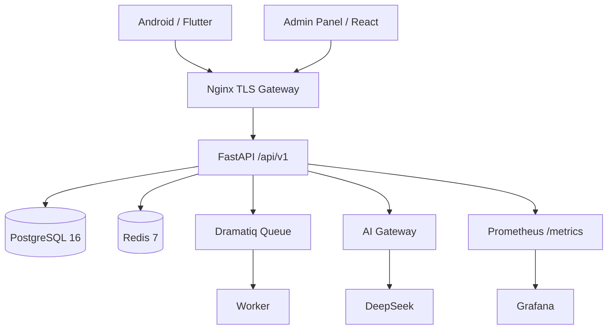

# AI Platform 2.1.1 — Autonomous Software Engineering Platform

AI Platform is a production-oriented AI application stack composed of a FastAPI backend, PostgreSQL, Redis, Dramatiq workers, a React/TypeScript administrative console, and a Flutter Android client. DeepSeek credentials live only on the server. The backend enforces authentication, rotating refresh tokens, per-user quotas, rate limiting, feature flags, audit/security events, device binding, AI metadata retention, and operational health checks.

## Autonomous Engineering Runtime v2.1

Version 2.1 adds a full project/run model on top of the production stack: isolated per-user workspaces, hardened ZIP import, planner/architect/implementer/tester/security/dependency/reviewer/repair/QA/release agents, Git checkpoints and run diffs, bounded repair loops, monorepo-aware quality gates, secret/risk scanning, dependency intelligence, project memory, local sparse code embeddings for relevance-ranked code search, resumable human approvals, live run events, admin visibility, and Android project/run controls. Generated file operations are confined to the project workspace. AI-requested commands are allow-listed and are not auto-executed unless `ENGINEERING_AUTO_EXECUTE_COMMANDS=true`.

New in 2.1: a run now **pauses** when command approval is required and automatically resumes from the same implementer phase after all decisions are made. Tester, security and dependency analysis execute as a parallel verification group. The code index stays local to the workspace and does not send source to an embedding provider.

Key API root: `/api/v1/engineering`. Create a project, import a source ZIP, create a run, and start it.

## Architecture



The production network publishes only Nginx. PostgreSQL, Redis, the API container, and workers remain on Docker networks. `docker-compose.prod.yml` maps host ports 80 and 443 to the unprivileged Nginx container ports 8080 and 8443.

## Repository layout

- `server/` — FastAPI, SQLAlchemy async, Alembic, AI gateway, CLI, worker, tests.
- `android/` — Flutter application with secure token storage, automatic refresh, RTL Hebrew/English, device management and AI chat.
- `admin/` — React + TypeScript + Material UI admin console.
- `deploy/` — Nginx, Prometheus, Grafana and systemd assets.
- `scripts/` — backup, restore, verification and release packaging.
- `docs/` — architecture, operations, security, API and release documentation.
- `.github/workflows/` — backend, Android, admin, security and release CI.

## Deploying on a VPS

A complete, step-by-step Ubuntu VPS installation guide in Hebrew is in
[`INSTALL-VPS-HE.md`](INSTALL-VPS-HE.md): server preparation, firewall, `.env`, TLS with
automatic renewal, the admin console, backups, upgrades and troubleshooting.

## Requirements

For local container development: Docker Engine 26+ with the Compose plugin. For direct backend development: Python 3.12. For the admin UI: Node.js 22+. For Android development: current Flutter stable, Android SDK and JDK 17. Production target is Ubuntu LTS.

## Initial configuration

```bash
cp .env.example .env
chmod 600 .env
```

Replace every `CHANGE_ME` value. Generate a strong JWT secret, for example with `python3 -c "import secrets; print(secrets.token_urlsafe(64))"`. Do not put the DeepSeek key in Android, React, Git, screenshots, logs, or CI artifacts.

Set at minimum PostgreSQL credentials, `DATABASE_URL`, `REDIS_URL`, `JWT_SECRET`, production `TRUSTED_HOSTS`, production `CORS_ORIGINS`, and optionally `DEEPSEEK_API_KEY`. Set `SERVER_NAME` before using the production TLS compose overlay.

## Development with Docker

```bash
make up
make logs
make migrate
curl http://127.0.0.1:8080/health
curl http://127.0.0.1:8080/health/ready
```

The default compose file binds the local Nginx gateway to `127.0.0.1:8080`. It does not publish PostgreSQL or Redis.

## Database migrations

```bash
docker compose run --rm api alembic upgrade head
```

Production never uses `Base.metadata.create_all()`. Schema evolution is performed with Alembic.

## Admin bootstrap

Interactive creation is preferred so the password is not stored in shell history:

```bash
docker compose run --rm api python -m app.cli create-admin
```

The CLI also accepts `ADMIN_EMAIL` and `ADMIN_INITIAL_PASSWORD` from the environment for controlled first-install automation. Password policy is still enforced.

## DeepSeek setup

Configure only the server:

```dotenv
DEEPSEEK_API_KEY=...
DEEPSEEK_BASE_URL=https://api.deepseek.com
DEEPSEEK_MODEL=deepseek-chat
DEEPSEEK_ALLOWED_MODELS=deepseek-chat,deepseek-reasoner
AI_PROVIDER_MODE=deepseek
```

If the API key is absent, AI requests return a configuration error rather than a fabricated response. `AI_PROVIDER_MODE=mock` is rejected outside `APP_ENV=test` and exists only for automated/load testing.

## Tests

```bash
make test-backend
make test-integration
make test-admin
make test-android
make lint
make security
```

The integration stack is isolated in `docker-compose.test.yml` and uses a deterministic test-only AI provider, PostgreSQL and Redis. No DeepSeek credits are consumed.

## Android build

```bash
cd android
flutter pub get
flutter analyze
flutter test
flutter build apk --debug --dart-define=API_BASE_URL=https://your-domain.example/api/v1
```

Release signing is loaded from `android/key.properties` and is never hardcoded. See `docs/ANDROID.md` for TLS pin rotation and release signing.

## Admin build

```bash
cd admin
npm install
npm run lint
npm run test
npm run build
```

Admin access/refresh tokens are kept in browser memory only; this intentionally trades persistent login for reduced token exposure. No browser cookie authentication is used, so the console does not rely on a CSRF token.

## Backups

```bash
make backup
./scripts/verify-backup.sh backups/<file>.dump
make restore FILE=backups/<file>.dump
```

Backups use PostgreSQL custom format with compression and SHA-256 sidecars. `BACKUP_UPLOAD_DIR` can point to a separately mounted remote-storage filesystem; cloud credentials are not embedded in this project.

## Production deployment

Read `docs/DEPLOYMENT.md` and `docs/SECURITY_HARDENING.md`. A normal Ubuntu deployment is:

```bash
cp .env.example .env
# edit and secure .env
./INSTALL_ALL.sh
# obtain Let's Encrypt certificate, set SERVER_NAME, then:
docker compose -f docker-compose.yml -f docker-compose.prod.yml up -d
./VERIFY_INSTALL.sh
```

Public firewall rules should allow 443 and, when needed for ACME/redirects, 80. Restrict SSH by source IP. Never expose 5432, 6379, or 8080 directly to the Internet.

## Observability

Start optional Prometheus and Grafana services with:

```bash
docker compose --profile observability up -d
```

Production Nginx intentionally does not expose `/metrics` publicly. Prometheus reaches the API on the internal Docker network.

## Release packaging

```bash
make package
```

This removes build/cache directories and secrets, creates the server, Android and complete ZIP archives, tests them with `unzip -t`, and writes `SHA256SUMS.txt`.
