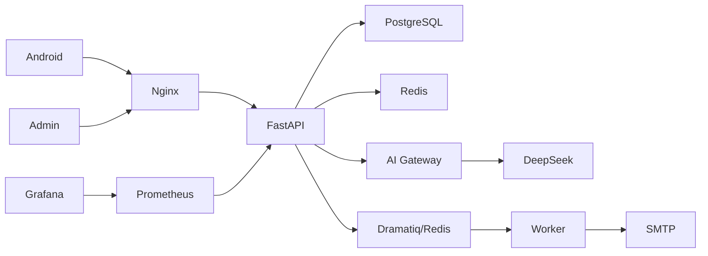

# Architecture

## Goals

The platform separates untrusted clients from infrastructure secrets and stateful services. Android and the admin SPA talk only to Nginx. Nginx terminates TLS and proxies `/api` to FastAPI. FastAPI owns authorization, persistence, rate limiting, AI policy and external integrations. Redis is used for atomic rate limits, AI cache, token-quota reservations and the Dramatiq broker. PostgreSQL is authoritative for users, sessions, devices, usage and audits.

## Backend boundaries

`api/` handles HTTP contracts and authorization dependencies. `services/` coordinates business workflows. `repositories/` contains query-focused persistence helpers. `security/` owns password/token/privacy/attestation controls. `ai/` defines provider abstraction, policy, quotas, cache orchestration and DeepSeek implementation. `models/` is the SQLAlchemy persistence schema. Alembic owns production schema creation and changes.

## Authentication sequence

1. Login validates email/password with Argon2id.
2. If the client supplies a previously registered server device UUID, ownership and revocation are checked.
3. A server session row and random refresh token family are created.
4. The access JWT contains user/session identifiers, a JTI and a short expiry.
5. The raw refresh token is returned once; only SHA-256 is persisted.
6. Refresh uses `SELECT ... FOR UPDATE`, marks the old token used/revoked and inserts a child token in the same family.
7. Reuse of an old token revokes every active token in the family and records a high-severity security event.

## AI request sequence

Validation → authentication → policy/model allowlist → atomic per-minute/day quota checks → daily token reservation → cache lookup → circuit-breaker check → DeepSeek request/retries → response validation → usage accounting → metadata/audit persistence → response. Raw prompts are not persisted unless encrypted prompt retention is explicitly enabled.

## Failure domains

A DeepSeek outage maps to stable API error codes and cannot crash the process. Repeated provider failures open a Redis-backed short circuit. Redis is required for authenticated rate limiting and AI quotas; readiness fails when unavailable. Maintenance lookup fails open to avoid turning a Redis outage into an application-wide forced maintenance outage. PostgreSQL transaction failures are rolled back by the request-session dependency.
